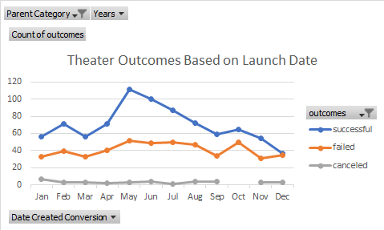
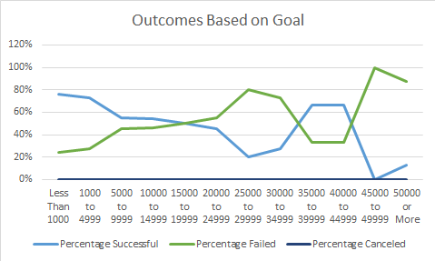

# An Analysis of Kickstarter Campaigns

## Overview of Project

An analysis of Kickstarter campaigns to find out optimum fundraising goals and launch dates.

## Analysis

The following chart was made showing theatre outcomes based on launch date. Kickstarter information was filtered to only include theatre campaigns and showing the numbers of successful, failed and canceled outcomes for each month. All years available were taken into consideration.

The next chart was made to show outcomes based on the goal amounts for the Kickstarter campaigns. After breaking down the number of theatre campaigns to the number that were successful, failed and canceled for each goal range, the numbers were further broken down to percentages.

## Results From Theatre Outcomes By Launch Date:

The information shows that the while theatre shows appear to be more successful than not from January to March and from September to November, most successful shows appear to launch in May, June and July. In December the number of successful shows drops off and is approximately the same as those that failed. There are not many canceled shows, and they stay relatively steady throughout the year.

## Results From the Outcomes Based on Goals:

More shows were actually successful that had lower goals than higher goals, especially with more shows that had a goal above $20,000 failing.

## Limitations & Difficulties of the Dataset

Limitations of the dataset include the fact that as the goal targets rose, the sample sizes shrank. There are especially small sample sizes for campaigns whose goals were between 25,000 and 49,999. This can be somewhat made up with the fact that the numbers of successful, failed and canceled were illistrated with percentages.

Another possible graph that could be used that could help better explain the Outcomes based on goals would be a box and whisker chart to help control for outliers in the data.
